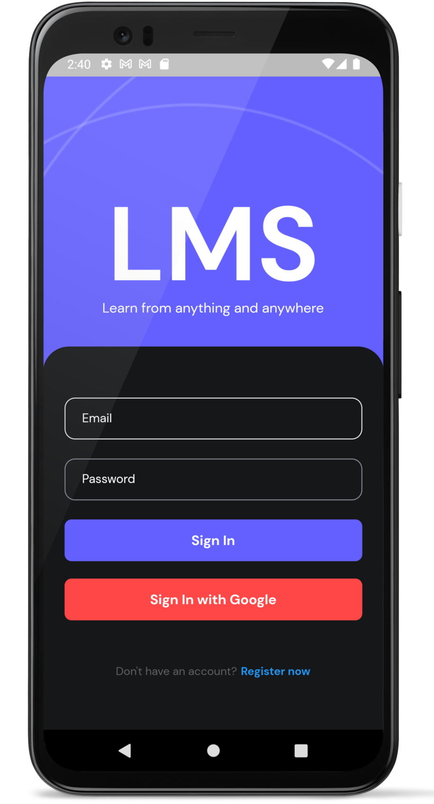
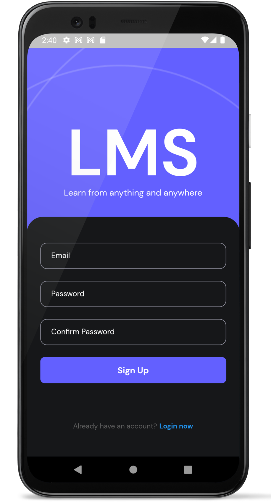
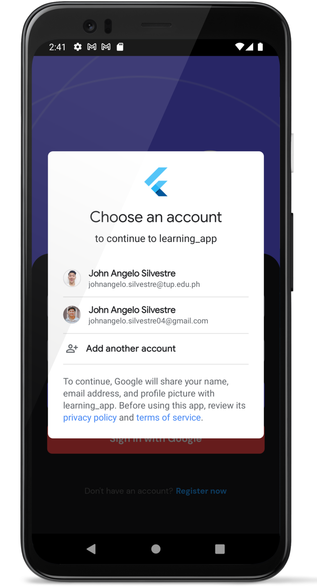
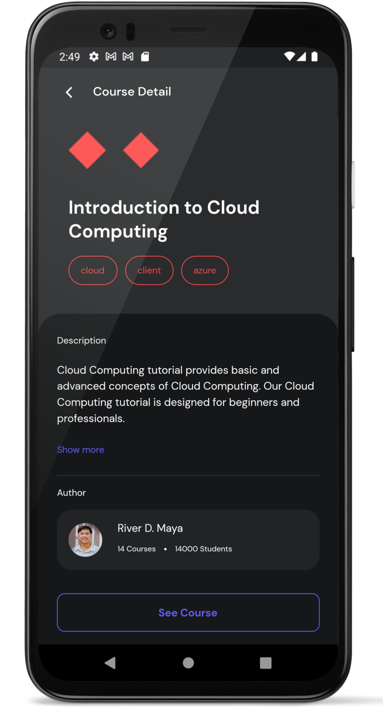
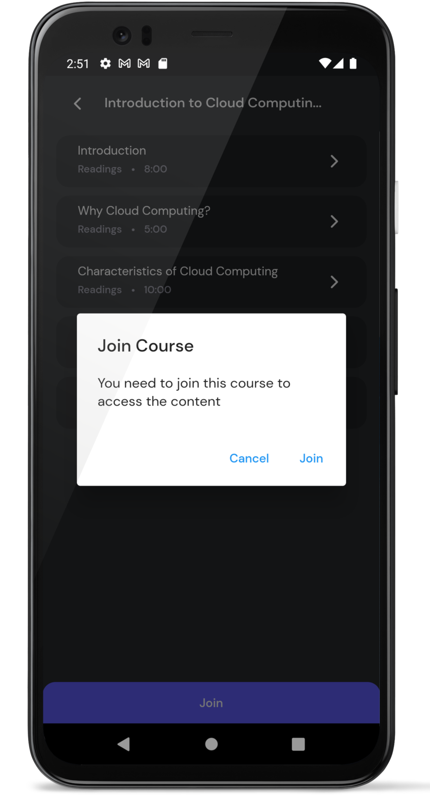
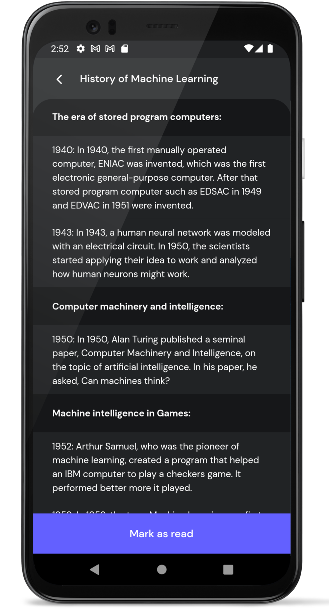

# Learning Management System

A Learning Management System built using Flutter.

## Overview

This project includes the following features:

- Data Mining of Courses on the Internet
- Google Sign in library implementation for easy login using Auth_Service
- Sign Up screen UI and functionality with TextFieldForm and User Validation
- Bottom Navigation bar for easy navigation
- Home Screen with StatusCard Widget and Courses ListView
- GestureDetector implementation for better user experience
- Explore Screen with Searchbar, Categories, and ListView
- My Course Screen with Tabs for In Progress and Done and Listview per tabs
- Account Screen with UserHeader Profile, buttons for Account Settings, Support, and SignOut
- Course Details Screen with CourseHeader, CourseDescription, ShowMoreButton Functionality, AuthorProfile, and buttons for Join and See Details
- CourseList Screen with Listview of topics for specific Course, Join Button, and Alert Dialog
- Screen Routing and Project Directory Structuring for easy management of the project.

## Installation

1. Clone the repository or download the zip file
```
git clone https://github.com/code-jas/flutter_lms_app.git
```

2. Change directory to the project
```
cd flutter_lms_app
```

3. Install the required packages
```
flutter pub get
```

## Getting Started

1. After completing the installation process, open the project in your favorite editor.

2. Run the project on your emulator or physical device
```
flutter run
```

## Features

- User authentication using Google Sign in library
- Course details with CourseHeader, CourseDescription, ShowMoreButton Functionality, and AuthorProfile
- Search and filter courses based on Categories
- User profile with user settings and support buttons
- Join courses and mark them as In Progress or Done.

## Contributors

- [John Angelo Silvestre](https://github.com/code-jas): UI design and development
- [John A. Lappay](https://github.com/supremoods): UI design and development
- [Camille Sta. Romana](https://github.com/camieller): Data mining and organization, JSON structure
- [Mary Antonnette Ubina](https://github.com/maubina): Data mining and organization, JSON structure

We are grateful for the contributions of these individuals and their work on this project. Thank you for your hard work and dedication!


## Screenshot

Here is a screenshot of the app in action:
<p align="center">
  
  
  
  
  
  
  
  
  
  
  
  
  
  
  
</p>

